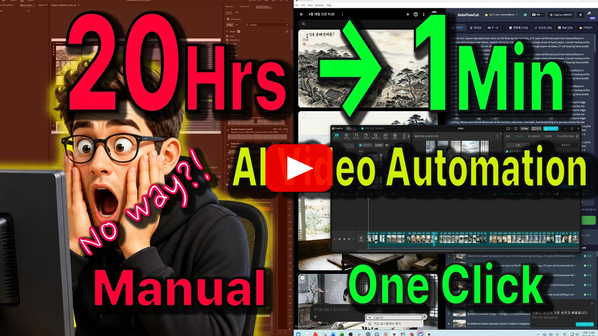

# AutoFlowCut

<kbd>🇺🇸 English</kbd> <kbd>[🇰🇷 한국어](README.ko.md)</kbd>

<p align="center">
  <a href="https://youtu.be/cqxvDx9HTvQ">
    
  </a>
</p>

A desktop app that **mass-generates** images and videos with Google Flow AI and exports them to CapCut projects in one click.

[](https://github.com/touchizen/AutoFlowCut/releases)
[](LICENSE)

## Overview

Still building AI videos one shot at a time?

AutoFlowCut automates the entire AI video production pipeline. Generate images and videos with Google Flow AI (labs.google/fx), then convert them into ready-to-edit CapCut projects. Import your script, generate visuals, pick the best media per scene, and export in a single click.

## Features

### AI Image / Video Generation
- **Batch image generation** — Generate 100+ AI images in a single batch via Google Flow AI, with automatic retry on errors.
- **T2V (Text-to-Video)** — Generate video clips from text prompts (Veo 3.1).
- **I2V (Image-to-Video)** — Convert generated images into videos.
- **Image upscaling** — 2K / 4K upscale support.
- **Per-scene media selection** — Automatically pick the best media among Image / T2V / I2V (priority: I2V > T2V > Image).

### Reference System
- **Character / background / style references** — Tag-based auto-matching keeps 200+ scenes visually consistent.
- **87 style presets** — Animation, photography, film, and 8 more categories.
- **Auto-injected style prompts** — Reference styles are automatically merged into generation prompts.

### CapCut Export
- **One-click export** — Complete project with timeline, media, subtitles, and Ken Burns animation.
- **Direct CapCut project folder write** — No ZIP download required.
- **Auto-launch CapCut** — The CapCut app opens automatically after export.
- **SRT subtitles** — Multilingual subtitles included in export.

### Audio / SFX Integration
- **Audio package import** — Automatic detection of narration, voice, and SFX files.
- **SRT timecode matching** — Audio placement aligned to subtitle timing.
- **Multi-track timeline** — Image / subtitle / narration / voice / SFX tracks with horizontal zoom, scrub, and playhead.
- **Expandable groups** — Voice / SFX collapse by character / category; expand sub-tracks to see individual file rows.
- **File row mini-markers** — Each file row shows a colored bar at its clip's position so timing context is preserved when scrolling.
- **Drag-to-adjust timecode** — Drag any voice / SFX clip to nudge its timing; persisted to `.audio_overrides.json` without touching original files.
- **Resizable lanes** — Per-track height and label-column width are draggable, persisted to localStorage.
- **Preview panel** — Current playhead position shows the matched scene image + SRT subtitle.
- **Keyboard shortcuts** — `Space` play/pause, `Esc` stop and rewind.
- **Audio review system** — Flag unsuitable audio with reason and bulk-clean tracks.

### MCP Server (Claude Code integration)
- **Built-in MCP server** — Edit scenes / references / prompts directly from Claude Code.
- **HTTP API bridge** — Integrate with external tools (port 3210).
- **Skill system** — Install and manage Claude Code skills; auto-installed on the app's first run.
- **Story Engine v2** — End-to-end 9-wave pipeline from script to CapCut export.
  - `/story-new` → Initialize an episode + discuss the topic.
  - `/story-execute` → Run W1–W9 automatically (sub-agents + review loops, two user gates at W3/W7).
  - `/story-step` → Run the next single wave only and exit. Manual mode — no in-wave prompts; the user reviews each wave's deliverables and re-invokes for the next.
  - `/story-next` → Resume after interruption (delegates to `/story-execute`).
  - `/story-rewrite` → Improve an existing episode (engagement-gap diagnosis → fork → partial wave re-run).

### Miscellaneous
- **Dual-view layouts** — Tab / horizontal-split / vertical-split modes.
- **Multilingual UI** — Korean, English.
- **Project management** — Manage multiple projects independently, backed by `project.json`.
- **Flexible input formats** — Import TXT, CSV, and SRT files.

## Tech Stack

| Category | Technology |
|----------|-----------|
| **Frontend** | React 18 + Vite 6 |
| **Desktop** | Electron 36 |
| **AI Engine** | Google Flow AI (labs.google/fx) |
| **Backend** | Firebase (Auth, Firestore, Cloud Functions) |
| **MCP** | @modelcontextprotocol/sdk |
| **Payments** | Lemon Squeezy |
| **Build** | electron-builder (DMG, ZIP, NSIS, APPX) |
| **Testing** | Vitest |

## Architecture

```
Electron BrowserWindow
├── [Layout Mode] — Tab / horizontal-split / vertical-split (Shell.jsx)
│
├── [App View] — React (BrowserWindow webContents)
│   ├── Header — project picker, Export, Settings
│   ├── PromptInput — prompt entry
│   ├── SceneList — scene list (image / video / subtitle)
│   ├── ReferencePanel — reference management
│   ├── AudioPanel — audio / SFX import
│   └── StatusBar — generation progress
│
├── [Flow View] — WebContentsView (labs.google/fx/tools/whisk)
│   └── Google login + Flow AI embedded browser
│
└── [MCP Server] — stdio + HTTP (port 3210)
    └── Scene / reference / style / audio management tools
```

### IPC Namespaces

| Namespace | Role | File |
|-----------|------|------|
| `fs:*` | File I/O | `electron/ipc/filesystem.js` |
| `flow:*` | Flow API (token, image / video generation) | `electron/ipc/flow-api.js` |
| `flow:dom-*` | DOM automation (prompt injection, generation triggers) | `electron/ipc/dom.js` |
| `flow:video-*` | Video generation (T2V, I2V, upscale) | `electron/ipc/video.js` |
| `capcut:*` | CapCut path detection, project write, app launch | `electron/ipc/capcut.js` |
| `auth:*` | Google OAuth | `electron/ipc/auth.js` |

### Video Generation Pipeline (3-Phase Async)

```
Phase 1: Submit     → Submit video requests sequentially (7–15s interval)
Phase 2: Poll       → Poll all generationIds in parallel (up to 20 min)
Phase 3: Download   → Download + save completed videos sequentially
```

## Project Structure

```
AutoFlowCut/
├── electron/                    # Electron main process
│   ├── main.js                 # Main process + WebContentsView management
│   ├── preload.js              # Context bridge (window.electronAPI)
│   └── ipc/                    # IPC handlers
│       ├── filesystem.js       # File I/O
│       ├── flow-api.js         # Flow API (image / video generation)
│       ├── dom.js              # DOM automation (prompt injection, generation)
│       ├── video.js            # Video (T2V, I2V, upscale)
│       ├── capcut.js           # CapCut path detection, project write
│       ├── auth.js             # Google OAuth
│       └── shared.js           # Shared utilities
│
├── src/                        # React frontend
│   ├── App.jsx                 # Main app logic
│   ├── Shell.jsx               # Layout manager (tab / split)
│   ├── components/             # UI components (35+)
│   │   ├── Header.jsx
│   │   ├── SceneList.jsx
│   │   ├── ReferencePanel.jsx
│   │   ├── AudioPanel.jsx
│   │   ├── ExportModal.jsx
│   │   ├── SettingsModal.jsx
│   │   ├── SceneDetailModal.jsx
│   │   ├── VideoDetailModal.jsx
│   │   └── ...
│   ├── hooks/                  # React hooks (15+)
│   │   ├── useFlowAPI.js       # Flow API wrapper (token, image, video)
│   │   ├── useAutomation.js    # Batch image generation pipeline
│   │   ├── useVideoAutomation.js # Video generation (3-phase async)
│   │   ├── useSceneGeneration.js # Per-scene regeneration
│   │   ├── useReferenceGeneration.js # Reference generation
│   │   ├── useGenerationQueue.js # Unified generation queue
│   │   ├── useExport.js        # CapCut export
│   │   ├── useAudioImport.js   # Audio import + SRT matching
│   │   ├── useScenes.js        # Scene state management
│   │   ├── useProjectData.js   # project.json management
│   │   └── ...
│   ├── exporters/              # CapCut JSON generation + disk write
│   ├── firebase/               # Auth, Firestore, Cloud Functions
│   ├── contexts/               # AuthContext
│   ├── config/                 # Defaults, style presets (87)
│   ├── locales/                # ko, en
│   ├── utils/                  # Utilities (parsers, tag matching, ...)
│   └── stripe/                 # Payments (Lemon Squeezy)
│
├── mcp-server/                 # MCP server (Claude Code integration)
│   └── index.js                # Scene / reference / style / audio / skill tools
│
├── skills/                     # Claude Code skills
│   ├── story-engine/           # Story Engine v2 (9-wave pipeline)
│   ├── story-new/              # /story-new episode init
│   ├── story-execute/          # /story-execute W1–W9 auto-runner
│   ├── story-next/             # /story-next resume
│   ├── story-step/             # /story-step single-wave manual runner
│   └── story-rewrite/          # /story-rewrite episode improvement
├── docs/                       # Documentation (schemas, store descriptions, ...)
├── tests/                      # Vitest unit + integration tests (mirrors src/)
├── scripts/                    # Build helpers (electron name patch, build-number bump, ...)
├── assets/                     # App icons (icon.icns, icon.png)
├── public/                     # Static assets (style thumbnails)
├── vite.config.js
└── package.json
```

## Getting Started

### Prerequisites

- Node.js 18+
- npm
- Google account (for Flow AI access)
- CapCut desktop app

### Install

```bash
git clone https://github.com/touchizen/AutoFlowCut.git
cd AutoFlowCut
npm install
```

### Develop

```bash
# Dev mode (test environment — uses _test GCF)
npm run dev

# Dev mode (prod environment — uses _prod GCF)
npm run dev:prod
```

### Build

```bash
# macOS distribution (DMG + ZIP, code-signed + notarized)
npm run dist:mac

# Windows distribution (NSIS + ZIP + APPX, Certum OV code-signed)
npm run dist:win

# Windows individual targets
npm run dist:win:nsis    # For website download (.exe, code-signed)
npm run dist:win:appx    # For MS Store (.appx)

# Linux distribution (AppImage + deb)
npm run dist:linux

# Test-environment distribution
npm run dist:test:mac
npm run dist:test:win

# Packaging test (no installers)
npm run pack
```

> **Windows code signing**: If SimplySign Desktop is connected during build, the binary is signed automatically (Certum OV certificate).

Build artifacts are written to the `release/` directory.

### Test

```bash
npm test              # Watch mode
npm run test:run      # One-shot run
npm run test:coverage # Coverage report
```

Tests live in `tests/` and mirror the `src/` directory layout (Vitest + jsdom + @testing-library/react).

### Environment Separation (test / prod)

Cloud Functions are deployed with `_test` / `_prod` suffixes.

| Script | Environment | GCF suffix |
|--------|-------------|------------|
| `npm run dev` | test | `_test` |
| `npm run dev:prod` | prod | `_prod` |
| `npm run dist:mac` / `dist:win` | prod | `_prod` |
| `npm run dist:test:mac` / `dist:test:win` | test | `_test` |

## How to Use

1. Launch the app and sign in to Google from the **Flow tab**.
2. Switch to the **App tab**.
3. Enter prompts (type directly, or import from TXT / CSV / SRT).
4. Configure reference images (character, background, style tags).
5. Click **Generate Images** to start batch generation.
6. (Optional) **Generate videos** via T2V or I2V.
7. Click **Export** — the CapCut project is written to disk and CapCut launches automatically.

## MCP Server

Edit AutoFlowCut scenes / references / prompts directly from Claude Code.

### Key Tools

| Tool | Description |
|------|-------------|
| `load_csv` | Load a CSV file + images |
| `list_scenes` / `get_scene` | Query scenes |
| `update_prompt` / `batch_update_prompts` | Edit prompts |
| `list_references` / `update_reference_prompt` | Manage references |
| `list_problem_scenes` | Filter problem scenes |
| `list_styles` | Browse style presets |
| `export_capcut` | Export to CapCut |
| `install_skill` / `list_skills` | Manage skills |
| `get_progress` | Read `W_progress.json` (sub-agents write it directly via file I/O) |
| `app_generate_scene` / `app_start_scene_batch` | App-integrated generation |

### HTTP API

When the HTTP server is enabled in settings (default port 3210):

```
GET  /api/current-project  — Current project state
POST /api/scenes           — Query scenes
POST /api/references       — Query references
POST /api/generate         — Trigger image generation
```

## Download

- **macOS / Windows**: [GitHub Releases](https://github.com/touchizen/AutoFlowCut/releases)
- **Windows (MS Store)**: [Microsoft Store](https://apps.microsoft.com/detail/9N38G1SCG12J)

## Links

- **Homepage**: [touchizen.com](https://touchizen.com)
- **YouTube**: [@touchizen](https://youtube.com/@touchizen)
- **Discord**: [touchizen](https://discord.gg/DTMMs8TZDN)
- **Contact**: gordon.ahn@touchizen.com

## License

Copyright (C) 2026 Touchizen

This program is free software: you can redistribute it and/or modify it under
the terms of the **GNU Affero General Public License v3** as published by the
Free Software Foundation. See [LICENSE](LICENSE) for the full text.

> **What this means**: you are free to use, modify, and self-host AutoFlowCut.
> If you distribute a modified version — including running it as a hosted
> network service — your changes must also be released under AGPL v3.

Contributions are accepted under the same AGPL v3 license — see
[CONTRIBUTING.md](CONTRIBUTING.md).

---

*Disclaimer: This app is an independent product developed by Touchizen and is not affiliated with, endorsed by, or sponsored by Google or ByteDance (CapCut).*
